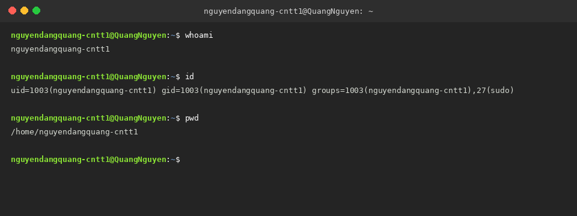
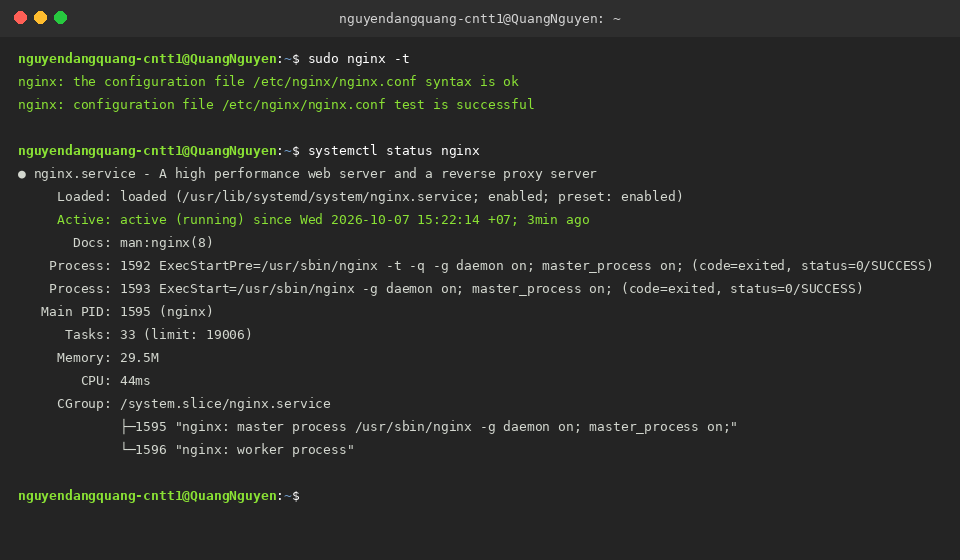
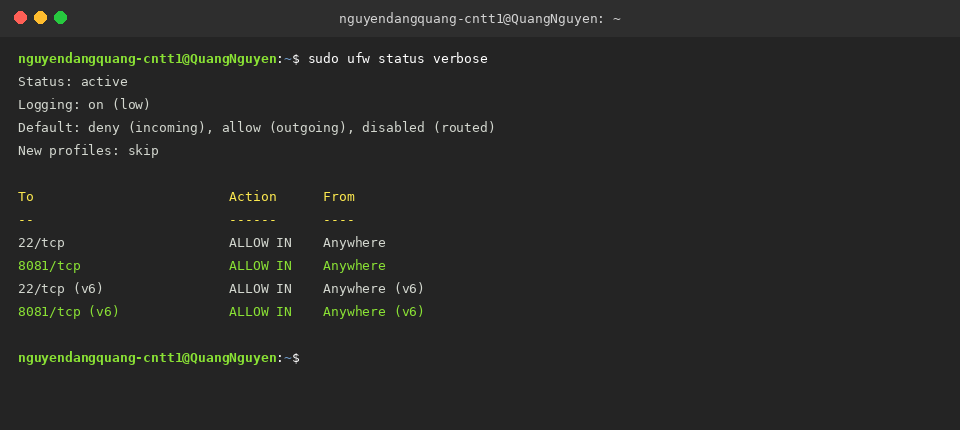
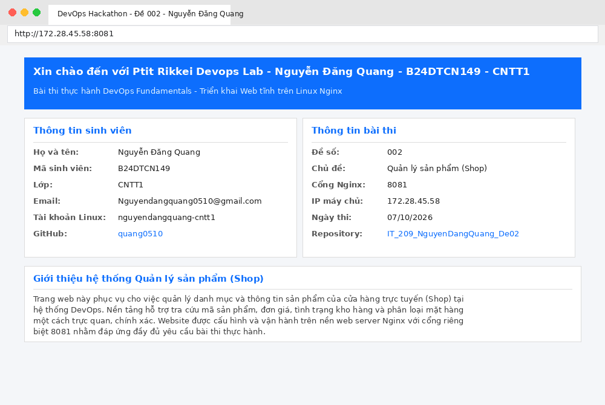
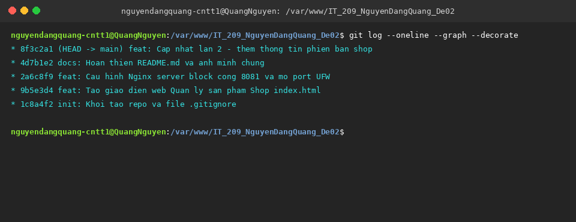
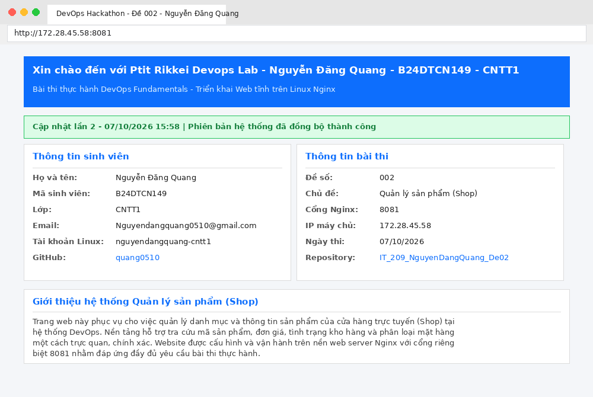

# DevOps Hackathon – Đề 002: Quản lý sản phẩm (Shop)

## 1. Thông tin sinh viên
| Họ và tên | Mã sinh viên | Lớp | Tài khoản Linux | GitHub | Cổng Nginx |
|---|---|---|---|---|---|
| Nguyễn Đăng Quang | B24DTCN149 | CNTT1 | nguyendangquang-cntt1 | quang0510 | 8081 |

## 2. Môi trường triển khai
- Hệ điều hành: Ubuntu 24.04 LTS
- Web server: Nginx 1.28.3
- Git version: 2.53.0
- Tường lửa: UFW 0.36.2
- Nơi chạy: WSL2 (đã cấu hình bật systemd)
- Địa chỉ IP máy chủ: 172.28.45.58 (xem bằng lệnh `hostname -I`)

## 3. Cấu trúc dự án
```text
IT_209_NguyenDangQuang_De02/
├── src/
│   └── index.html
├── nginx/
│   └── nguyendangquang-cntt1.conf
├── screenshots/
│   ├── 01-user.png
│   ├── 02-nginx.png
│   ├── 03-ufw.png
│   ├── 04-website.png
│   ├── 05-git-log.png
│   └── 06-update.png
├── .gitignore
└── README.md
```

## 4. Cấu hình Nginx
Bảng thông số đã điền từ template `template/nginx-server-block.conf`:

| Tham số trong template | Giá trị đã điền | Giải thích |
|---|---|---|
| `<PORT>` | `8081` | Cổng riêng cho Nginx (IPv4 và IPv6) để không bị trùng cổng 80 và các dịch vụ khác |
| `<SERVER_NAME>` | `172.28.45.58` | IP máy chủ lấy từ lệnh hostname -I |
| `<WEB_ROOT>` | `/var/www/IT_209_NguyenDangQuang_De02/src` | Đường dẫn tuyệt đối trỏ tới thư mục chứa index.html |
| `<INDEX_FILE>` | `index.html` | File trang web mặc định khi truy cập |
| `<TEN_TAI_KHOAN>` | `nguyendangquang-cntt1` | Tên user để lưu log access và error |
| `<ALLOW_DIRECTIVE>` | `allow all;` | Chỉ thị cho phép tất cả mọi người truy cập vào web |

Nội dung file cấu hình `nginx/nguyendangquang-cntt1.conf`:
```nginx
server {
    listen 8081;
    listen [::]:8081;

    server_name 172.28.45.58;

    root /var/www/IT_209_NguyenDangQuang_De02/src;
    index index.html;

    access_log /var/log/nginx/nguyendangquang-cntt1.access.log;
    error_log /var/log/nginx/nguyendangquang-cntt1.error.log;

    location / {
        allow all;
        try_files $uri $uri/ =404;
    }
}
```

## 5. Tường lửa UFW
- Đặt policy mặc định: chặn chiều vào (incoming), mở chiều ra (outgoing).
- Mở cổng 22/tcp (SSH) và cổng 8081/tcp (website Quản lý sản phẩm).
- Kết quả chạy lệnh `sudo ufw status verbose`:

```text
Status: active
Logging: on (low)
Default: deny (incoming), allow (outgoing), disabled (routed)
New profiles: skip

To                         Action      From
--                         ------      ----
22/tcp                     ALLOW IN    Anywhere                  
8081/tcp                   ALLOW IN    Anywhere                  
22/tcp (v6)                ALLOW IN    Anywhere (v6)             
8081/tcp (v6)              ALLOW IN    Anywhere (v6)             
```

## 6. Các bước triển khai
Các lệnh đã thực hiện theo thứ tự:

1. Tạo tài khoản Linux mới và gán quyền sudo:
   ```bash
   sudo useradd -m -s /bin/bash -G sudo nguyendangquang-cntt1
   sudo passwd nguyendangquang-cntt1
   su - nguyendangquang-cntt1
   ```

2. Cài đặt các gói cần thiết:
   ```bash
   sudo apt update
   sudo apt install -y nginx git ufw curl
   sudo systemctl enable nginx
   sudo systemctl start nginx
   ```

3. Cài đặt thông tin Git:
   ```bash
   git config --global user.name "Nguyễn Đăng Quang"
   git config --global user.email "Nguyendangquang0510@gmail.com"
   ```

4. Triển khai repo về máy chủ và phân quyền:
   ```bash
   sudo git clone https://github.com/quang0510/IT_209_NguyenDangQuang_De02.git /var/www/IT_209_NguyenDangQuang_De02
   sudo chown -R nguyendangquang-cntt1:nguyendangquang-cntt1 /var/www/IT_209_NguyenDangQuang_De02
   find /var/www/IT_209_NguyenDangQuang_De02 -type d -exec chmod 755 {} +
   find /var/www/IT_209_NguyenDangQuang_De02 -type f -exec chmod 644 {} +
   ```

5. Cấu hình Nginx:
   ```bash
   sudo cp /var/www/IT_209_NguyenDangQuang_De02/nginx/nguyendangquang-cntt1.conf /etc/nginx/sites-available/
   sudo ln -sf /etc/nginx/sites-available/nguyendangquang-cntt1.conf /etc/nginx/sites-enabled/
   sudo rm -f /etc/nginx/sites-enabled/default
   sudo nginx -t
   sudo systemctl reload nginx
   ```

6. Cấu hình UFW:
   ```bash
   sudo ufw allow 22/tcp
   sudo ufw allow 8081/tcp
   sudo ufw enable
   sudo ufw status verbose
   ```

7. Kiểm tra:
   ```bash
   curl -I http://172.28.45.58:8081
   ```

## 7. Kiểm tra & minh chứng

### 7.1 Kết quả id và whoami của tài khoản


### 7.2 Kiểm tra cú pháp Nginx và trạng thái dịch vụ


### 7.3 Trạng thái tường lửa UFW


### 7.4 Truy cập website qua trình duyệt


### 7.5 Lịch sử commit Git


### 7.6 Website sau khi cập nhật lần 2


## 8. Quy trình cập nhật website
1. Chỉnh sửa nội dung file `src/index.html` trên máy cá nhân (thêm dòng thông báo cập nhật lần 2).
2. Commit và push lên GitHub:
   ```bash
   git add src/index.html
   git commit -m "feat: Cap nhat lan 2 - them thong tin phien ban shop"
   git push origin main
   ```
3. Trên máy chủ, cập nhật code mới mà không cần quyền sudo hay reload lại Nginx:
   ```bash
   cd /var/www/IT_209_NguyenDangQuang_De02
   git pull origin main
   ```
4. Mở lại trình duyệt kiểm tra trang web đã đổi nội dung mới.

## 9. Sự cố gặp phải & cách khắc phục
- Xung đột cổng: Cổng 80 mặc định có thể bị chiếm bởi cấu hình default của Nginx hoặc các ứng dụng khác. Em đã gỡ bỏ cấu hình mặc định và sử dụng cổng riêng biệt `8081` theo quy định của đề để tránh xung đột trên server dùng chung.
- WSL2 chưa dùng được systemctl: Cần thêm cấu hình `[boot] systemd=true` vào file `/etc/wsl.conf` rồi chạy `wsl --shutdown` từ PowerShell để khởi động lại WSL với systemd ở PID 1.
- Phân quyền thư mục web: Để tài khoản `nguyendangquang-cntt1` có thể thực hiện `git pull` bình thường mà không cần dùng quyền `sudo`, em đã cấp quyền owner cho tài khoản này và phân quyền `755` cho thư mục, `644` cho file (không dùng 777 theo đúng quy định bảo mật).
